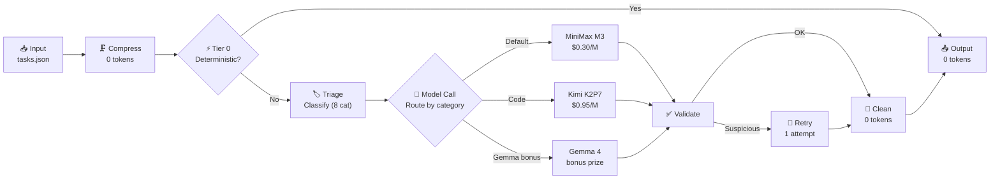

# Adaptive Model Dispatcher

<p align="center">
  
</p>

<p align="center">
  
</p>

<p align="center">
  <strong>AMD Developer Hackathon: ACT II — Track 1: General-Purpose AI Agent</strong><br>
  <em>A token-efficient, category-aware routing agent that intelligently processes batches of diverse AI tasks while minimizing token consumption.</em>
</p>

<p align="center">
  
  
  
  
  
</p>

---

## ⚡ How It Works

Adaptive Model Dispatcher routes each task through the most cost-effective path using a **5-layer pipeline**:



### Pipeline Stages

| Stage | What it does | Token cost |
|-------|-------------|-----------|
| **Compress** | Removes redundant whitespace, URLs, repeated punctuation (preserves code blocks) | 0 |
| **Tier 0** | Deterministic arithmetic, percentages, powers, unit conversions | 0 |
| **Triage** | Two-layer classifier: regex heuristic (0 tokens) → model fallback if uncertain | 0 or ~100 |
| **Model Call** | Routes to optimal model based on category + role mapping | varies |
| **Validate** | Free deterministic checks catch empty/truncated/invalid responses | 0 |
| **Clean** | Strips intro phrases, markdown fences, formats for LLM-Judge | 0 |

## 🎯 Key Features

- **🔋 Zero-Token Solving** — Arithmetic, percentages (`15% of 200`), unit conversions (`5 km to m`), square/cube/sqrt solved without any API calls
- **🏷️ Smart Triage** — Two-layer classifier (regex heuristics + lightweight model fallback) categorizes tasks at near-zero cost
- **🎯 Optimal Model Selection** — Each of 8 categories is routed to the best-fit model
- **🛡️ Speculative Validation** — Free deterministic checks catch empty/truncated/invalid responses, triggering corrective retries
- **⚡ Gemma Circuit-Breaker** — After the first Gemma failure, subsequent tasks skip the timeout
- **🧠 Local Model Tier** — Qwen 2.5 1.5B runs inside the container for sentiment/NER/summary at 0 Fireworks tokens
- **🔒 Robust Batch Processing** — Isolated error handling per task, atomic file writes, deadline-aware processing
- **📊 Monitoring Dashboard** — Real-time dark-mode dashboard visualizing routing decisions, token usage, and pipeline flow

## 📋 8 Supported Task Categories

| Category | Model Role | Routing Strategy | max_tokens |
|----------|-----------|------------------|-----------|
| Factual Knowledge | default | Gemma → MiniMax M3 fallback | 160 |
| Mathematical Reasoning | reasoning | MiniMax M3 (concise step-by-step) | 320 |
| Sentiment Classification | default | Local Qwen → Gemma → MiniMax M3 | 48 |
| Text Summarization | default | Local Qwen → Gemma → MiniMax M3 | 192 |
| Named Entity Recognition | default | Local Qwen → Gemma → MiniMax M3 | 192 |
| Code Debugging | code | Kimi K2P7 Code | 768 |
| Logical Reasoning | reasoning | MiniMax M3 | 384 |
| Code Generation | code | Kimi K2P7 Code | 768 |

## 📁 Project Structure

```
optiroute-ai/
├── config.py                  # Environment variables, model catalog, role assignment
├── fireworks_client.py        # Fireworks API wrapper — ALLOWED_MODELS guard, token tracking
├── deterministic_solver.py    # Tier 0 — arithmetic, percentages, unit conversions (0 tokens)
├── triage.py                  # 8-category classification (heuristic + model fallback)
├── prompt_compressor.py       # Whitespace/URL/punctuation compression (preserves code)
├── validator.py               # Free, deterministic response validation
├── answer_cleaner.py          # Post-processing: strips intro phrases, markdown fences
├── local_model.py             # In-container Qwen 2.5 1.5B inference (0 Fireworks tokens)
├── router.py                  # AdaptiveDispatcher — the main orchestrator
├── main.py                    # Harness entry point — batch I/O + run_report generation
├── fake_fireworks_client.py   # Offline fake client for local testing
├── dashboard/                 # Monitoring dashboard (HTML/CSS/JS)
│   ├── index.html             # Dark-mode glassmorphism dashboard
│   ├── style.css              # Premium styling with animations
│   └── app.js                 # Chart.js visualizations + data loading
├── local_test/                # Sample task sets for development
│   ├── tasks.json             # 8 tasks (one per category)
│   └── tasks_challenge.json   # 15 challenging edge-case tasks
├── tests/                     # pytest suite (133 tests, no real API calls)
├── Dockerfile                 # Multi-stage build (Python 3.11 + Qwen model)
└── requirements.txt           # openai, python-dotenv, tenacity, llama-cpp-python
```

## 🚀 Setup

```bash
python -m venv venv
source venv/bin/activate   # Windows: venv\Scripts\activate
pip install -r requirements-dev.txt

cp .env.example .env
# Fill .env with your Fireworks API key:
#   FIREWORKS_API_KEY=fw_...
```

## 🧪 Running Tests

```bash
pytest tests/ -v
```

All 133 tests run with mocked `FireworksClient` — **none connect to the real Fireworks API**, so they work without an API key and complete in under 2 seconds.

## 🖥️ Offline End-to-End Test (no API key needed)

```bash
export TASKS_INPUT_PATH=./local_test/tasks.json
export RESULTS_OUTPUT_PATH=./local_test/results.json
export USE_FAKE_FIREWORKS=1
python main.py
cat local_test/results.json
```

This mode uses `fake_fireworks_client.py` to run the entire pipeline without any real API calls — useful for verifying the pipeline doesn't crash and routes correctly.

## 📊 Dashboard

After running `main.py`, a `run_report.json` is generated alongside `results.json`. To view the monitoring dashboard:

```bash
# Start a local server from the project root
python -m http.server 8000

# Open in browser
# http://localhost:8000/dashboard/index.html
```

You can also drag-and-drop any `run_report.json` onto the dashboard page.

## 🐳 Docker Build & Submission

```bash
# Standard build (Intel/AMD machines):
docker build --tag <your-image>:latest .

# Apple Silicon — MUST specify platform:
docker buildx build --platform linux/amd64 --tag <your-image>:latest --push .
```

### Pre-submission Checklist

- [x] Image uses `linux/amd64` manifest
- [x] Image size ≤ 10GB
- [x] `.env` file is NOT copied into the image (`.dockerignore` prevents this)
- [x] 133 automated tests passing
- [x] Gemma circuit-breaker for runtime optimization
- [x] Local model (Qwen 2.5) for 0-token inference
- [x] Monitoring dashboard included
- [x] Run report auto-generated

## 🏗️ Architecture Decisions

| Decision | Rationale |
|----------|-----------|
| Gemma "try first, fallback silently" | Gemma bonus prize opportunity, but not serverless on Fireworks |
| Circuit-breaker after first Gemma failure | Prevents 6s×N timeout waste across batch |
| Local Qwen model for light categories | 0 Fireworks tokens for sentiment/NER/summarization |
| Corrective retry on same model | No clear model ladder in Track 1; different model adds complexity |
| `temperature=0.0` default | Consistency > creativity for a deterministic router |
| Tier 0 limited to safe patterns | Wrong guess on word problems risks accuracy gate elimination |
| Atomic writes (`tmp` + `os.replace`) | Half-written `results.json` = zero score |
| Category-tuned max_tokens | Prevents token waste (e.g., sentiment needs only 48 tokens) |

## 🛠️ Technologies

- **Language:** Python 3.11
- **AI Platform:** Fireworks AI
- **Models:** MiniMax M3, Kimi K2P7 Code, Google Gemma 4, Qwen 2.5 (local)
- **Containerization:** Docker (multi-stage build)
- **Testing:** pytest (133 tests)
- **Dashboard:** HTML/CSS/JS + Chart.js

## 📄 License

MIT
